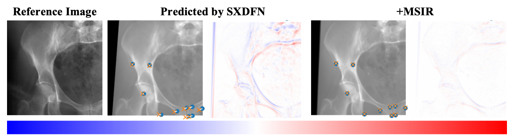

# Slice-based Cross-Dimensional Intraoperative Navigator
## Overview
SXDFN is a dedicated framework for intraoperative 2D/3D registration. Leveraging fundamental theories of CT and X-ray imaging, the proposed Slice-based Cross-Dimensional Fusion Network explicitly models the spatial relationship between intraoperative CT images and intraoperative X-ray images for accurate 2D/3D registration. To improve generalization, we introduce a Hierarchical Model Adaptation training pipeline, which evolves the model from instance-specific behavior to prior-aware reasoning, thus boosting robustness when handling novel data. Additionally, MSIR serves as a refinement module for the pose estimates output by SXDFN, allowing the overall system to achieve sub-millimeter level registration accuracy.

## SXDFN allows predicting pose based on different-dimensional images. 

## HMA allows quick adaptation to new patients

